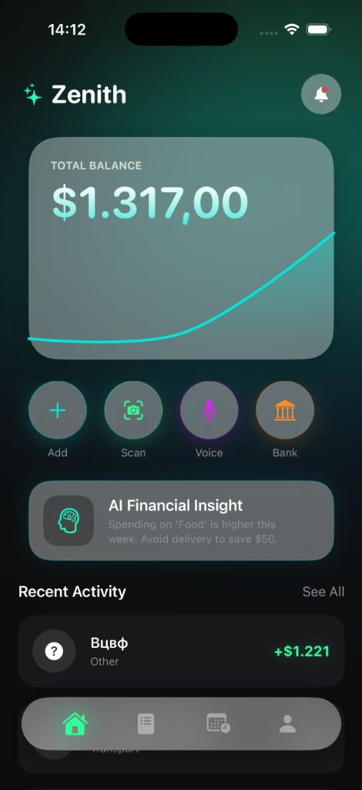
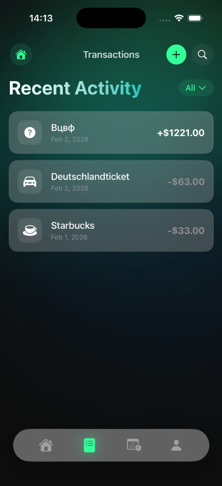
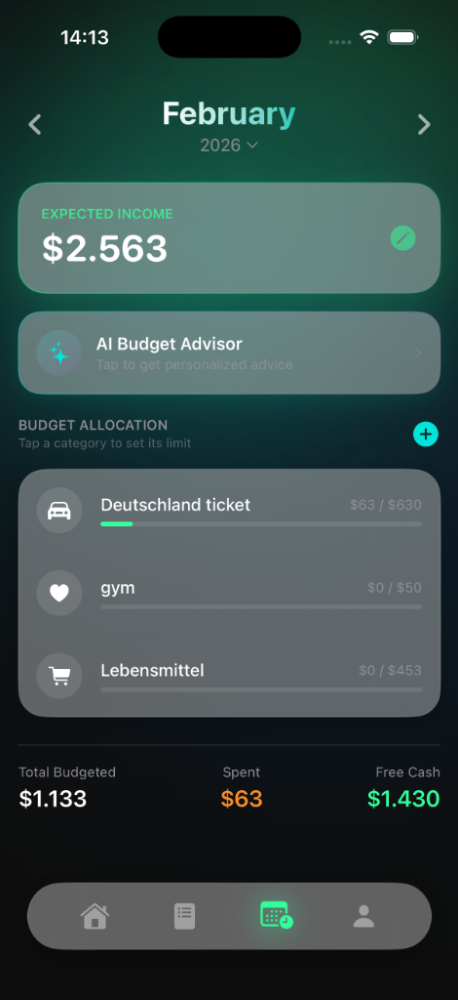
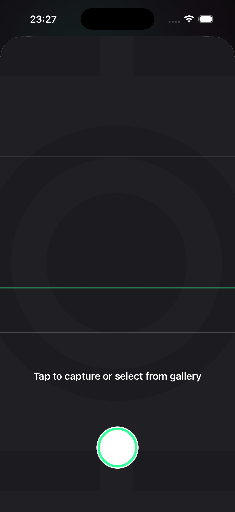
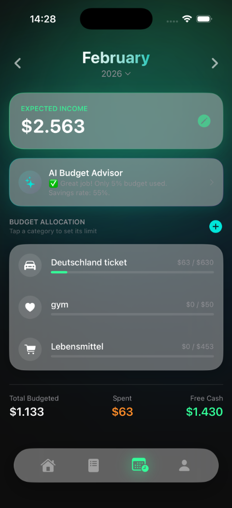
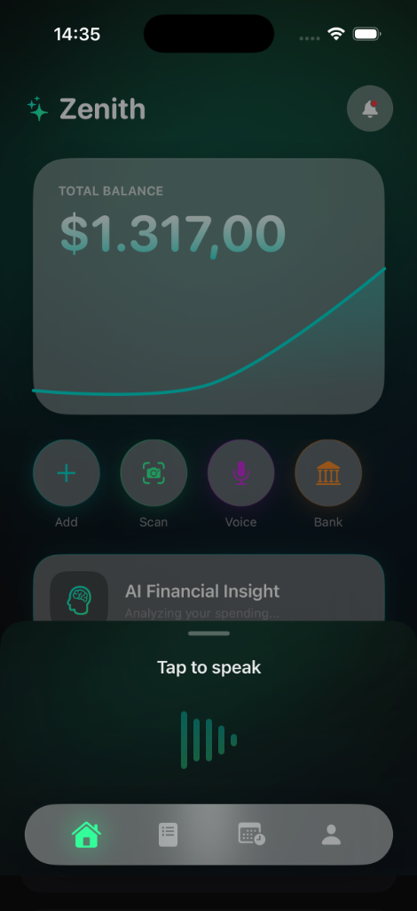
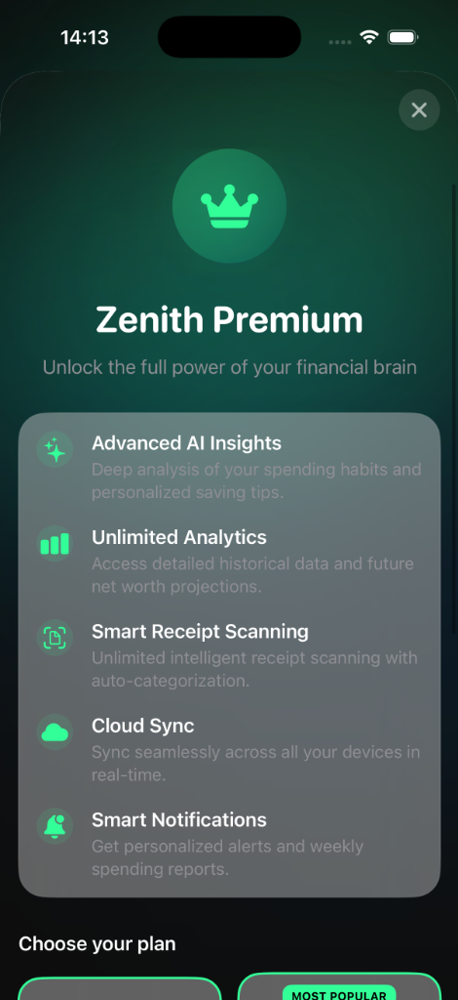

# Zenith Finance 🚀

## 📌 Kurzbeschreibung
**Zenith Finance** ist eine fortschrittliche iOS-Finanzplaner-App, die entwickelt wurde, um Nutzern durch KI-gestützte Analysen die volle Kontrolle über ihre persönlichen Finanzen zu geben. Die App vereint ein futuristisches, benutzerfreundliches Design mit leistungsstarken Funktionen wie intelligenter Sprachsteuerung, automatischem Beleg-Scanning und nahtloser iCloud-Synchronisierung. Zenith Finance transformiert das traditionelle Ausgabenmanagement in ein proaktives, datengesteuertes Erlebnis.

## ✨ Hauptfunktionen
*   **🤖 KI-Finanzassistent**: Persönliche Finanzberatung und Budgetoptimierung in Echtzeit, angetrieben durch die Groq AI API.
*   **🗣️ Voice-to-Text Transaktionen**: Schnelles Erfassen von Ausgaben und Einnahmen durch natürliche Sprachbefehle, unterstützt durch Apples Speech Framework.
*   **📸 Smart Receipt Scanner**: Automatische Extraktion von Händler-, Datums- und Betragsdaten aus Papierbelegen mithilfe von Computer Vision (Vision Framework).
*   **📊 Interaktive Analytics**: Detaillierte Visualisierung des Cashflows mit dynamischen, interaktiven Diagrammen (Swift Charts) und monatlichen Vergleichen.
*   **☁️ Cloud-Synchronisierung**: Sicherer und nahtloser Datenabgleich über alle Geräte hinweg mittels CloudKit und SwiftData.
*   **🔄 Wiederkehrende Zahlungen**: Automatisiertes Management von Abonnements und regelmäßigen Rechnungen mit Fälligkeitserinnerungen.
*   **📱 Smart Widgets**: Interaktive Homescreen-Widgets zeigen Tagesziele und aktuelle Budgets auf einen Blick.
*   **🔒 Sicherheit & Privatsphäre**: Biometrische Authentifizierung (FaceID/TouchID) und lokale Datenverarbeitung für maximalen Datenschutz.

## 🛠️ Technologiestack
Das Projekt basiert auf modernsten Apple-Technologien und folgt der MVVM-Architektur:

*   **Sprache**: Swift 5.10
*   **UI-Framework**: SwiftUI (mit komplexen Animationen und Glassmorphism-Effekten)
*   **Datenpersisting**: SwiftData (mit CloudKit-Spiegelung)
*   **KI & Machine Learning**: 
    *   Vision Framework (OCR Text Recognition)
    *   Natural Language Processing (für Kategorisierung)
    *   Groq API (Generative AI Integration)
*   **System-Frameworks**:
    *   `Speech` & `AVFoundation` (Sprachverarbeitung)
    *   `Charts` (Datenvisualisierung)
    *   `WidgetKit` (App Extensions)
    *   `LocalAuthentication` (Biometrie)
    *   `Combine` (Reaktive Programmierung)

## 🚀 Installation & Setup

1.  **Repository klonen**:
    ```bash
    git clone https://github.com/egpdev/zenith-finance.git
    cd zenith-finance
    ```

2.  **Projekt in Xcode öffnen**:
    Öffnen Sie die Datei `calculateAI.xcodeproj` mit Xcode 15.0 oder neuer.

3.  **Abhängigkeiten laden**:
    Warten Sie, bis der Swift Package Manager alle Abhängigkeiten geladen hat.

4.  **Konfiguration (Optional)**:
    Für die volle KI-Funktionalität, fügen Sie Ihren API-Schlüssel in `GroqService.swift` ein:
    ```swift
    private let apiKey = "IHRE_GROQ_API_KEY" 
    ```

5.  **Starten**:
    Wählen Sie einen Simulator (empfohlen: iPhone 15 Pro / iOS 17+) und drücken Sie `Cmd+R`.

## 📱 Screenshots

### Core Experience
| Dashboard | Transactions | Planner | Scanner |
|:---:|:---:|:---:|:---:|
|  |  |  |  |

### Smart Features
| AI Insights | Voice Input | Premium | Widgets |
|:---:|:---:|:---:|:---:|
|  |  |  |  |

---
*Entwickelt mit ❤️ von Pylkov Egor*

Portfolio Project
